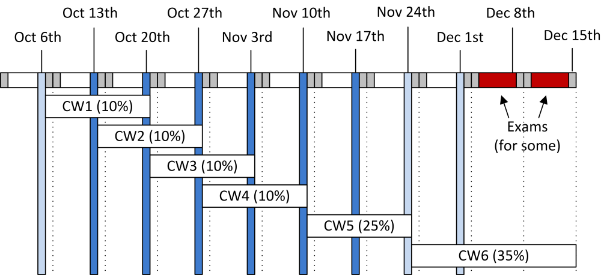

High Performance Computing For Engineers
========================================

Autum term 2017-2018

Please feel free to register issues on this repository if there is
information missing (though usually more attention is paid to the
currently active courseworks).

Coursework
----------

The course has six points of assessment, with the timeline
shown below:

Links will be made available according to that timeline.

- [Coursework 1](https://github.com/HPCE/hpce-2017-cw1).

- [Coursework 2](https://github.com/HPCE/hpce-2017-cw2).

- [Coursework 3](https://github.com/HPCE/hpce-2017-cw3).

- [Coursework 4](https://github.com/HPCE/hpce-2017-cw4).

- [Coursework 5](https://github.com/HPCE/hpce-2017-cw5).

- [Coursework 6](https://github.com/HPCE/hpce-2017-cw6).

Lecture notes
-------------

The [Panopto recordings](https://imperial.cloud.panopto.eu/Panopto/Pages/Sessions/List.aspx?folderID=2cdaa85b-941b-4e13-a84a-f389d0b681e1) are available to anyone who can access the panopto imperial site.

- [Lecture 0 (6th Oct) : introduction](slides/hpce-lec0-introduction.pdf)

  - [Initial lecture recording](https://imperial.cloud.panopto.eu/Panopto/Pages/Viewer.aspx?id=7cd4f204-fb13-4398-97ed-f2996e746804)

  - [TBB Demo](https://imperial.cloud.panopto.eu/Panopto/Pages/Viewer.aspx?id=8e5be91f-67b7-4d60-a0f2-b3ffa487d754)

- [Lecture 1 (13th Oct) : iterations spaces, parfor, and TBB](slides/hpce-lec1-parfor-plus-tbb.pdf)

  - [Part A recording](https://imperial.cloud.panopto.eu/Panopto/Pages/Viewer.aspx?id=fa54db88-26b9-4f46-93f6-e5b7a712bf2e)

  - [Part B recording](https://imperial.cloud.panopto.eu/Panopto/Pages/Viewer.aspx?id=cf633f28-063f-4322-a742-dee82d135ad1)

- [Lecture 2 (20th Oct) : TBB patterns + OpenCL Intro](slides/hpce-lec2-tbb-to-opencl.pdf)

  - [Part A recording](https://imperial.cloud.panopto.eu/Panopto/Pages/Viewer.aspx?id=e405c9ad-7c16-4751-a1e8-5d816209ba7b)

  - [Part B recording](https://imperial.cloud.panopto.eu/Panopto/Pages/Viewer.aspx?id=554152c5-4f32-41b6-926b-1b381f88f187)

- [Lecture 3 (27th Oct) : Pipelining and Performance](slides/hpce-lec3-pipelines-and-performance.pdf)

  - [Part A recording](https://imperial.cloud.panopto.eu/Panopto/Pages/Viewer.aspx?id=9dc77bf6-266e-410f-a59d-0f5d5d6e8517)

  - [Part B recording](https://imperial.cloud.panopto.eu/Panopto/Pages/Viewer.aspx?id=116974c5-f174-4c5e-ab86-6887aa9fb792)

- [Lecture 4 (3rd Nov) : Modelling and Critical Work](slides/hpce-lec4-modelling-and-critical-work.pdf)

  - [Part A recording](https://imperial.cloud.panopto.eu/Panopto/Pages/Viewer.aspx?id=1d9eb8ea-4097-42c6-958e-a668a33be90e)
  
  - [Part B recording](https://imperial.cloud.panopto.eu/Panopto/Pages/Viewer.aspx?id=1a817168-3550-4597-8a16-a5c10bb526cf)
  
- [Lecture 5 (10th Nov) : Critical work (contd.) + examples
  
  - [Part A recording](https://imperial.cloud.panopto.eu/Panopto/Pages/Viewer.aspx?id=184bf656-621b-4671-b3ce-5f46ca506c9f)
  
  - Part B was workshopping previous CW5 examples with class

- [Lecture 6 (17th Nov) : Performance Engineering](slides/hpce-lec6-performance-engineering.pdf)

  - [Part A recording](https://imperial.cloud.panopto.eu/Panopto/Pages/Viewer.aspx?id=0ce31855-ea37-4f63-959b-fc67f3915529)
  
  - [Part B recording](https://imperial.cloud.panopto.eu/Panopto/Pages/Viewer.aspx?id=383e2700-352e-4233-ae96-636e519c9e62)
  
- [Lecture 7 (24th Nov) : Case Studies](slides/hpce-lec7-case-studies.pdf)

  - [Part A recording](https://imperial.cloud.panopto.eu/Panopto/Pages/Viewer.aspx?id=cc7dfa47-7c35-4583-9c2e-cd15ee85b4b1)
  
  - Part B of the recording failed, but it didn't contain technical content anyway. Mainly discussing the course and getting feedback.

That concludes all the lectures - enjoy the coursework...

